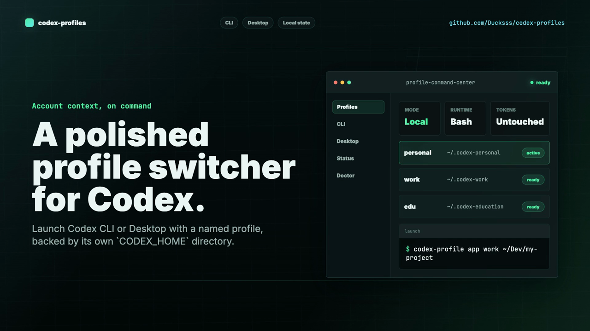

# codex-profiles

[](https://github.com/Ducksss/codex-profiles/actions/workflows/ci.yml)
[](LICENSE)
[](bin/codex-profile)
[](#platform-support)

Switch Codex accounts without swapping token files by hand.

`codex-profiles` is a tiny Bash wrapper around Codex's `CODEX_HOME` support. It
launches the Codex CLI or Codex Desktop app with a named profile so each account
gets its own auth, config, sessions, plugins, logs, and local Codex state.

This is for switching Codex accounts and local state, not just model or approval
settings.

```sh
codex-profile cli personal
codex-profile cli work exec "review this repo"
codex-profile app edu
```

## Why This Exists

Codex can read state from a custom `CODEX_HOME`, but typing the full command is
annoying:

```sh
CODEX_HOME="$HOME/.codex-personal" codex
CODEX_HOME="$HOME/.codex-work" codex exec "review this repo"
CODEX_HOME="$HOME/.codex-education" /Applications/Codex.app/Contents/MacOS/Codex
```

Many people end up copying `auth.json` files around instead. That works until it
doesn't: connector state, sessions, plugin caches, config, and logs remain shared.

`codex-profiles` keeps the workflow simple while using the cleaner boundary:
separate Codex homes.

## Demo

[](codex-profiles-saas-hyperframes/renders/codex-profiles-saas-promo.mp4)

## Features

- Named profiles backed by separate `CODEX_HOME` directories.
- Works with both Codex CLI and Codex Desktop.
- No token copying, parsing, printing, or storage logic.
- Profile-local desktop logs with private permissions.
- `doctor` and `status` commands for quick debugging.
- No third-party runtime dependencies.
- Tested on macOS and Ubuntu in GitHub Actions.

## Install

```sh
git clone https://github.com/Ducksss/codex-profiles.git
cd codex-profiles
make install
```

`make install` copies `bin/codex-profile` to `~/.local/bin/codex-profile`.
Make sure `~/.local/bin` is on your `PATH`.

Verify:

```sh
codex-profile doctor
```

## Quick Start

Log in to each account once:

```sh
codex-profile login personal
codex-profile login work
codex-profile login edu
```

Run Codex CLI with a profile:

```sh
codex-profile cli personal
codex-profile cli work exec "run tests and summarize failures"
codex-profile cli edu review
```

On macOS, run Codex Desktop with a profile:

```sh
codex-profile app personal
codex-profile app work ~/Dev/my-project
codex-profile app edu
```

Check your setup:

```sh
codex-profile status
codex-profile doctor
```

`status` is read-only: it reports missing profiles as `Not initialized` instead
of creating directories for typos.

## Profile Home Paths

Default `CODEX_HOME` path mappings:

```text
default, dev, main  -> ~/.codex
edu, education      -> ~/.codex-education
any other name      -> ~/.codex-<profile>
```

Examples:

```text
personal -> ~/.codex-personal
work     -> ~/.codex-work
edu      -> ~/.codex-education
```

You can inspect a profile path without launching Codex:

```sh
codex-profile path personal
```

## Recommended Aliases

Add aliases to your shell config if you want shorter commands:

```sh
alias codex-personal='codex-profile cli personal'
alias codex-work='codex-profile cli work'
alias codex-app-work='codex-profile app work'
```

## Commands

```text
codex-profile app <profile> [workspace]
codex-profile cli <profile> [codex-args...]
codex-profile login <profile> [codex-login-args...]
codex-profile status [profile]
codex-profile path <profile>
codex-profile doctor
```

## Platform Support

CLI-oriented commands (`cli`, `login`, `status`, `path`, and most of `doctor`)
are Bash-based and tested on macOS and Ubuntu/Linux.

The `app` command is macOS-only because it launches `Codex.app` and uses macOS
app-control tooling to quit the running desktop app before relaunching it with a
different `CODEX_HOME`.

## Desktop App Notes

Codex Desktop should run one profile at a time. `codex-profile app <profile>`
asks the running Codex app to quit, waits for it to close, and then launches the
app with the selected `CODEX_HOME`.

For best results, launch Codex Desktop through this tool instead of Dock or
Spotlight when you care which account is active.

## Security Model

This tool does not copy, parse, print, or manage auth tokens. It only sets
`CODEX_HOME` before running Codex.

This is safer than swapping `auth.json` files because each profile gets its own
Codex state directory. It is still not full OS-level isolation: external
credentials such as SSH keys, GitHub CLI auth, browser cookies, npm, AWS, or
Google Cloud credentials are still shared by your operating system user.

For strict work/personal separation, use separate OS users.

## Environment Overrides

```text
CODEX_APP       Override Codex.app path
CODEX_APP_BIN   Override Codex Desktop binary path
CODEX_CLI       Override Codex CLI binary path
```

Example:

```sh
CODEX_CLI=/path/to/codex codex-profile cli personal
```

## FAQ

### Is this an official OpenAI project?

No. This project is community-maintained and is not affiliated with OpenAI.

### Is this the same as Codex's built-in config profiles?

No. Codex config profiles switch settings inside one `CODEX_HOME`, such as
model, approval policy, sandboxing, and hooks.

`codex-profiles` switches `CODEX_HOME` itself, so each account can have separate
auth, config, sessions, plugins, logs, caches, and local Codex state.

### Does it copy my tokens?

No. It does not read or copy `auth.json`. Codex itself creates and uses auth
inside the selected `CODEX_HOME`.

### Why not just swap `auth.json`?

Swapping only `auth.json` leaves other Codex state shared: sessions, config,
plugins, logs, connector/app caches, and more. Separate `CODEX_HOME` directories
are a cleaner boundary.

### Can I run two desktop profiles at once?

Not safely. Codex Desktop is treated as one active profile at a time. The `app`
command quits the current Codex app before launching the selected profile.

### Does this isolate external tools too?

No. Your OS user still shares SSH keys, GitHub CLI auth, cloud CLIs, browser
state, and other non-Codex credentials.

## Development

```sh
make test
```

Optional ShellCheck:

```sh
make lint
```

The test suite covers Bash syntax, profile path mapping, install smoke tests,
fresh-profile status checks, private desktop log placement, and missing-CLI
doctor output.

## Contributing

Issues and pull requests are welcome. See [CONTRIBUTING.md](CONTRIBUTING.md) for
local setup, testing, and contribution guidelines.

## License

MIT
