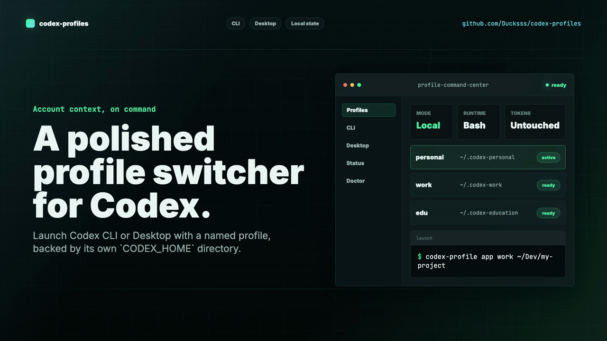

# codex-profiles

[](https://github.com/Ducksss/codex-profiles/actions/workflows/ci.yml)
[](https://github.com/Ducksss/codex-profiles/releases)
[](https://www.npmjs.com/package/codex-profile)
[](LICENSE)
[](bin/codex-profile)
[](#platform-support)

Switch Codex CLI and Desktop accounts with isolated `CODEX_HOME` profiles
instead of copying `auth.json` token files around.

`codex-profiles` is a small Bash wrapper around Codex's `CODEX_HOME` support.
Each profile gets its own Codex home directory, so auth, settings, sessions,
connectors, plugins, caches, logs, and local state stay separated while the
wrapper launches Codex CLI or Codex Desktop with the selected profile.

```sh
codex-profile cli personal
codex-profile cli work exec "review this repo"
codex-profile app edu
```

## Why It Exists

Codex already supports custom state directories through `CODEX_HOME`:

```sh
CODEX_HOME="$HOME/.codex-personal" codex
CODEX_HOME="$HOME/.codex-work" codex exec "review this repo"
CODEX_HOME="$HOME/.codex-edu" /Applications/Codex.app/Contents/MacOS/Codex
```

That is the right boundary, but it is awkward to type and easy to forget.
Copying `auth.json` is worse: it moves tokens while leaving sessions, config,
connector state, plugins, caches, and logs shared.

`codex-profile` gives the clean boundary a short command.

## Why Not Swap Auth Files?

Auth-file switchers only move `auth.json`. That can change who Codex logs in as,
but it still leaves unrelated account state in the same `CODEX_HOME`: sessions,
config, plugins, connector and app caches, logs, and other local files.

`codex-profile` switches the whole Codex home instead. The boundary is the same
one Codex already supports, just named and wrapped in a CLI:

```text
auth.json switcher      -> one shared CODEX_HOME with swapped tokens
codex-profile <profile> -> one CODEX_HOME per profile
```

That makes it a better fit for work, personal, education, and client accounts
where local Codex state should not bleed between contexts.

## Demo



[Watch the short reveal video](media/codex-profiles-apple-reveal.mp4)

## Highlights

- Isolated Codex homes per profile.
- CLI and Codex Desktop launch support.
- No token copying, parsing, printing, or migration.
- Read-only `list`, `status`, and `doctor` commands for diagnostics.
- JSON output for automation.
- Profile lifecycle commands: `init` and confirmed `remove`.
- Profile-local desktop logs with private permissions.
- Safe config cloning for known non-secret config files.
- Bash, Zsh, and Fish completion generators.
- Source-style self-upgrade with dry-run preview.
- No third-party runtime dependencies.
- Tested on macOS and Ubuntu.

## Install

With npm:

```sh
npm install -g codex-profile
```

The npm package is `codex-profile` (singular). It installs both the
`codex-profile` and `codex-profiles` commands. Use the singular package name;
the plural `codex-profiles` package on npm is a different project.

With Homebrew:

```sh
brew install Ducksss/tap/codex-profile
```

With npm directly from this GitHub repo:

```sh
npm install -g github:Ducksss/codex-profiles
```

From source:

```sh
git clone https://github.com/Ducksss/codex-profiles.git
cd codex-profiles
make install
```

Source installs copy `bin/codex-profile` to
`~/.local/bin/codex-profile`. Make sure `~/.local/bin` is on your `PATH`.

Verify the install:

```sh
codex-profile doctor
```

## Quick Start

Create and log in to each profile once:

```sh
codex-profile init personal
codex-profile init work
codex-profile login personal
codex-profile login work
```

Run Codex CLI with a profile:

```sh
codex-profile cli personal
codex-profile cli work exec "run tests and summarize failures"
```

Run Codex Desktop with a profile on macOS:

```sh
codex-profile app personal ~/Dev/my-project
codex-profile app work
```

Check what exists and what is logged in:

```sh
codex-profile list
codex-profile status
codex-profile doctor
```

## How Profiles Map To Disk

Only `default` is special:

```text
default     -> ~/.codex
<profile>   -> ~/.codex-<profile>
```

Examples:

```text
personal -> ~/.codex-personal
work     -> ~/.codex-work
dev      -> ~/.codex-dev
main     -> ~/.codex-main
edu      -> ~/.codex-edu
```

Profile names must start with a letter or number, then may contain letters,
numbers, dots, dashes, or underscores. You can inspect a path without launching
Codex:

```sh
codex-profile path personal
```

## Common Workflows

### Manage Profiles

Create a profile home without launching Codex:

```sh
codex-profile init client-a
```

Remove a profile home interactively:

```sh
codex-profile remove client-a
```

Use `--yes` for scripts:

```sh
codex-profile remove client-a --yes
```

Use `default` explicitly if you intend to remove `~/.codex`. Every other valid
name removes only its own `.codex-<profile>` directory.

### Inspect Status

Human-readable output:

```sh
codex-profile status
codex-profile status personal
codex-profile doctor
```

Machine-readable output:

```sh
codex-profile status --json
codex-profile doctor --json
```

`status` and `list` are read-only. They report missing profiles instead of
creating directories for typos.

### Read Desktop Logs

Desktop logs live inside the selected profile home:

```sh
codex-profile logs personal --path
codex-profile logs personal
codex-profile logs personal --tail 100
```

### Clone Safe Config

Copy known non-secret config files from one profile to another:

```sh
codex-profile clone-config personal work
codex-profile clone-config personal work --force
```

Only these root-level files are considered:

```text
config.toml
AGENTS.md
instructions.md
custom-instructions.md
```

`clone-config` never copies `auth.json`, sessions, plugins, logs, caches, or
directories. It also refuses files with sensitive-looking key names such as
`token`, `secret`, `password`, `credential`, or `api_key`.

### Upgrade Source Installs

Preview the upgrade:

```sh
codex-profile upgrade --dry-run
```

Install from the default project repo and branch:

```sh
codex-profile upgrade
```

By default, `upgrade` fetches `main` from
`https://github.com/Ducksss/codex-profiles.git` into
`~/.cache/codex-profile/source`, then runs `make install` with
`PREFIX=~/.local`.

Use a different install prefix or source ref:

```sh
codex-profile upgrade --prefix /usr/local
codex-profile upgrade --ref v0.2.0
codex-profile upgrade --ref <commit-sha>
```

Upgrade refuses to install a candidate with no declared version, or a candidate
whose declared version is older than the running `codex-profile`.

If you installed with Homebrew and do not want a source-style
`~/.local/bin/codex-profile`, use Homebrew instead:

```sh
brew upgrade Ducksss/tap/codex-profile
```

## Shell Completions

Generate completions for Bash, Zsh, or Fish:

```sh
codex-profile completions bash
codex-profile completions zsh
codex-profile completions fish
```

Bash example:

```sh
mkdir -p ~/.local/share/bash-completion/completions
codex-profile completions bash > ~/.local/share/bash-completion/completions/codex-profile
```

Zsh example:

```sh
mkdir -p ~/.zfunc
codex-profile completions zsh > ~/.zfunc/_codex-profile
```

Add the directory to `fpath` in `~/.zshrc` before `compinit`:

```sh
fpath=(~/.zfunc $fpath)
autoload -Uz compinit
compinit
```

## Aliases

Aliases are optional, but useful for accounts you use every day:

```sh
alias codex-personal='codex-profile cli personal'
alias codex-work='codex-profile cli work'
alias codex-app-work='codex-profile app work'
```

## Command Reference

```text
codex-profile app <profile> [workspace]
codex-profile cli <profile> [codex-args...]
codex-profile login <profile> [codex-login-args...]
codex-profile init <profile>
codex-profile remove <profile> [--yes]
codex-profile status [profile]
codex-profile status --json [profile]
codex-profile path <profile>
codex-profile logs <profile> [--path|--tail [lines]]
codex-profile clone-config <source-profile> <target-profile> [--force]
codex-profile list
codex-profile doctor [--json]
codex-profile completions <bash|zsh|fish>
codex-profile upgrade [--dry-run] [--prefix <path>] [--ref <git-ref>]
codex-profile version
codex-profile --version
```

## Environment Overrides

```text
CODEX_APP                      Override Codex.app path
CODEX_APP_BIN                  Override Codex Desktop binary path
CODEX_CLI                      Override Codex CLI binary path
CODEX_PROFILE_UPGRADE_REPO     Override upgrade repository
CODEX_PROFILE_UPGRADE_REF      Override upgrade git ref
CODEX_PROFILE_UPGRADE_CACHE    Override upgrade cache checkout
CODEX_PROFILE_UPGRADE_PREFIX   Override upgrade install prefix
```

Examples:

```sh
CODEX_CLI=/path/to/codex codex-profile cli personal
CODEX_PROFILE_UPGRADE_REF=v0.2.0 codex-profile upgrade --dry-run
```

## Platform Support

CLI-oriented commands are Bash-based and tested on macOS and Ubuntu/Linux:

```text
cli login init remove status path logs clone-config list doctor completions upgrade
```

The `app` command is macOS-only because it launches `Codex.app` and uses macOS
app-control tooling to quit the running desktop app before relaunching it with a
different `CODEX_HOME`.

## Desktop App Notes

Codex Desktop should run one profile at a time. `codex-profile app <profile>`
asks the running Codex app to quit, waits for it to close, and forces a
shutdown if it keeps hanging around before relaunching the app with the
selected `CODEX_HOME`.

For predictable account switching, launch Codex Desktop through `codex-profile`
instead of Dock or Spotlight.

## Security Model

`codex-profile` does one security-sensitive thing: it sets `CODEX_HOME` before
running Codex. It does not read, copy, print, parse, or migrate auth tokens.

`clone-config` uses a small allowlist and refuses sensitive-looking config
files. It does not inspect or rewrite Codex auth files.

`upgrade` fetches and installs code from the configured git repository. The
default repository is this project. `--dry-run` prints the source ref, cache
path, and install prefix before anything changes. Do not point upgrade at a
repository you do not trust.

Separate Codex homes are cleaner than swapping `auth.json`, but they are not
full OS-level isolation. Your operating system user still shares SSH keys,
GitHub CLI auth, browser cookies, cloud CLI credentials, npm state, and other
external credentials.

For strict work/personal separation, use separate OS users.

## FAQ

### Is this an official OpenAI project?

No. This project is community-maintained and is not affiliated with OpenAI.

### Is this the same as Codex's built-in config profiles?

No. Codex config profiles switch settings inside one `CODEX_HOME`, such as
model, approval policy, sandboxing, and hooks.

`codex-profiles` switches `CODEX_HOME` itself, so each account can have separate
auth, config, sessions, plugins, logs, caches, and local Codex state.

### Does it copy my tokens?

No. It does not read or copy `auth.json`. Codex itself creates and uses auth
inside the selected `CODEX_HOME`.

### Why not just swap `auth.json`?

Swapping only `auth.json` leaves other Codex state shared: sessions, config,
plugins, logs, connector/app caches, and more. Separate `CODEX_HOME` directories
are a cleaner boundary.

### Can I run two desktop profiles at once?

Not safely. Codex Desktop is treated as one active profile at a time. The `app`
command quits the current Codex app before launching the selected profile.

### Does this isolate external tools too?

No. Your OS user still shares SSH keys, GitHub CLI auth, cloud CLIs, browser
state, and other non-Codex credentials.

## Development

Run the test suite:

```sh
make test
```

Run ShellCheck:

```sh
make lint
```

The test suite covers Bash syntax, profile path mapping, install smoke tests,
CLI/login pass-through, list/version output, npm package installation, source
upgrades, fresh-profile status checks, hardened status discovery, private
desktop log placement, and missing-CLI doctor output.

## Contributing

Issues and pull requests are welcome. See [CONTRIBUTING.md](CONTRIBUTING.md) for
local setup, testing, and contribution guidelines.

Questions, workflow ideas, and launch feedback are welcome in the
[Codex profile workflows discussion](https://github.com/Ducksss/codex-profiles/discussions/1).

## License

MIT
