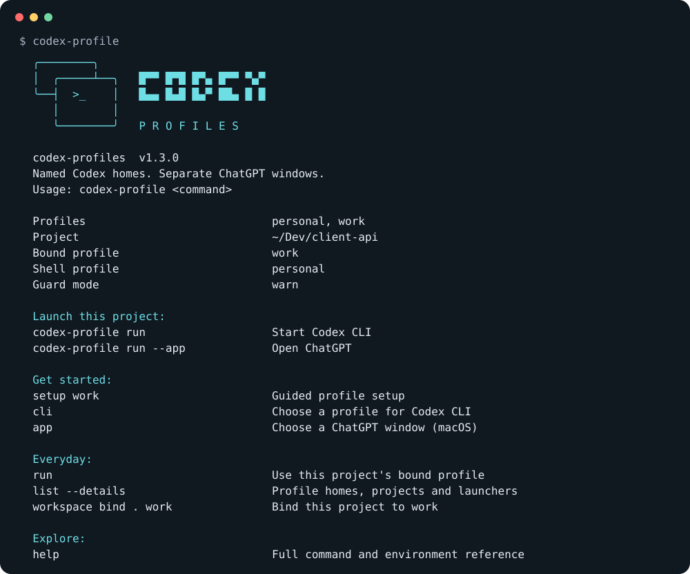

<a id="readme-top"></a>

<div align="center">
  <a href="https://github.com/Ducksss/codex-profiles">
    
  </a>

  <h1 align="center">Codex Profiles</h1>

  <p align="center">
    <strong>Manage Codex profiles and ChatGPT windows from your macOS menu bar.</strong>
    <br />
    See remaining Codex quota, open a profile, and keep personal, work and client sessions separate.
    <br />
    <br />
    <a href="#getting-started"><strong>Build for macOS »</strong></a>
    &middot;
    <a href="https://github.com/Ducksss/codex-profiles/blob/main/macos/README.md">Explore the docs</a>
    <br />
    <br />
    <a href="https://ducksss.github.io/codex-profiles/">Project site</a>
    &middot;
    <a href="https://github.com/Ducksss/codex-profiles/issues/new?template=bug_report.yml">Report a bug</a>
    &middot;
    <a href="https://github.com/Ducksss/codex-profiles/issues/new?template=feature_request.yml">Request a feature</a>
  </p>
</div>

<p align="center">
  <a href="https://github.com/Ducksss/codex-profiles/actions/workflows/ci.yml"></a>
  <a href="#prerequisites"></a>
  <a href="LICENSE"></a>
</p>

<p align="center">
  <picture>
    <source media="(prefers-color-scheme: dark)" srcset="https://github.com/Ducksss/codex-profiles/raw/refs/heads/main/macos/CodexProfilesMenu/Previews/menu-dark.png">
    
  </picture>
</p>

<p align="center">
  <em>The actual app view, rendered with sample quota values. Follows your light or dark appearance.</em>
  <br />
  macOS 13+ &middot; Apple silicon and Intel &middot; Build from source today
</p>

<details>
  <summary>Table of contents</summary>
  <ol>
    <li><a href="#about-the-project">About the project</a>
      <ul><li><a href="#built-with">Built with</a></li></ul>
    </li>
    <li><a href="#getting-started">Getting started</a>
      <ul>
        <li><a href="#prerequisites">Prerequisites</a></li>
        <li><a href="#installation">Installation</a></li>
      </ul>
    </li>
    <li><a href="#usage">Usage</a></li>
    <li><a href="#how-separation-works">How separation works</a></li>
    <li><a href="#command-line-usage">Command-line usage</a></li>
    <li><a href="#roadmap">Roadmap</a></li>
    <li><a href="#contributing">Contributing</a></li>
    <li><a href="#license">License</a></li>
    <li><a href="#contact">Contact</a></li>
    <li><a href="#acknowledgements">Acknowledgements</a></li>
  </ol>
</details>

## About the project

**Codex Profiles.app** puts your profiles and projects in the macOS menu bar.
Open a named ChatGPT window or start Codex in Terminal, check each profile's
remaining CLI quota, and get back to your project without signing out of
another profile.

- **Open profiles in one click.** Keep personal, work and client ChatGPT
  windows side by side, with separate local state. No project folder is required.
- **Check quota before switching.** See remaining Codex CLI limits, low-quota
  warnings and reset times beside each profile.
- **Keep projects close.** Bind a folder to a profile, pin frequent projects,
  and find them with search, filters or keyboard shortcuts.
- **Set up from the menu.** Create profiles, start CLI sign-in, repair moved
  folders and enable **Open at Login** from the app.
- **Use native macOS controls.** The app follows system appearance, accent
  colours, contrast, transparency and Reduce Motion preferences.

The app bundles the project's `codex-profile` Bash engine. The same profiles
and workspace bindings are available through the [CLI on macOS and Linux](#command-line-usage).
This is a community project and is not affiliated with OpenAI.

### Built with

- **Swift and AppKit** for the native menu bar, controls and dialogs.
- **Bash and standard system tools** for profile and workspace operations.

<p align="right">(<a href="#readme-top">back to top</a>)</p>

## Getting started

The macOS app is currently available **from source**. There is no published
signed app download yet, and npm and Homebrew install the CLI only.

### Prerequisites

- **macOS 13 or newer**, on Apple silicon or Intel.
- **Xcode Command Line Tools**, including Swift, to build the app. If needed,
  install them with `xcode-select --install`.
- The official **ChatGPT desktop app** to open ChatGPT windows.
- The official **Codex CLI** for Terminal launches, CLI sign-in and quota
  readings. It can be installed separately or discovered inside the ChatGPT app.

The built app includes `codex-profile`, so it needs no separate installation
of this project, npm or Homebrew.

### Installation

1. Clone the repository and build the app:

   ```sh
   git clone https://github.com/Ducksss/codex-profiles.git
   cd codex-profiles
   make menu-app
   open build/macos
   ```

2. Drag **Codex Profiles.app** from that folder to **Applications**, then open it.
3. Follow the [first-run steps](#open-your-first-profile) below. Once the app is
   in Applications, enable **Open at Login** in the gear menu if you want it to
   start when you log in.

Local builds are unsigned development builds. To create a disk image with an
Applications shortcut and SHA-256 checksum, run `make menu-dmg`. The
[macOS build guide](https://github.com/Ducksss/codex-profiles/blob/main/macos/README.md#build-locally)
covers packaging, Developer ID signing and notarisation.

<p align="right">(<a href="#readme-top">back to top</a>)</p>

<a id="menu-bar-app-macos"></a>

## Usage

### Open your first profile

1. Click the **Codex Profiles** menu-bar icon. Existing profiles appear automatically.
2. If you have no profiles, choose **Create profile…** and enter a name such as `personal`
   or `work`. To add another profile, choose **New profile…** in the gear menu.
3. Select **ChatGPT** at the top and click **Open** beside a profile. Sign in
   inside that window when prompted.

Different names can stay open side by side, and reopening a name keeps its
local data. `default` opens your normal ChatGPT session.
Choose **Terminal** at the top to launch Codex CLI for the selected profile.
Terminal actions may ask for macOS Automation permission on first use.

### Check remaining Codex quota

The **Codex left** column shows the percentage remaining in each reported
CLI quota window. Meters turn orange at 25% or less and red at 10% or less,
and a low-limit row shows when it resets. Hover a reading for its window
duration and reset time, or press **⌘R** to refresh.

Quota belongs to that profile's **Codex CLI sign-in**. To sign in, use
**Sign in to Codex CLI…** in the profile's actions menu, then refresh.
ChatGPT Desktop may use a different account, and the app does not compare
them. Unavailable readings leave profiles usable. See the
[quota guide](https://github.com/Ducksss/codex-profiles/blob/main/macos/README.md#codex-usage-beside-each-profile)
for supported accounts and troubleshooting.

### Add project shortcuts

Choose **Add workspace…**, select a folder and assign its profile. Pin
frequent projects, search by name or path, and filter by profile. Each row's
actions menu can open it in the other destination, change its profile,
locate a moved folder, or remove the binding without deleting the project.
Project shortcuts are optional and never change files in the project.

### Keyboard shortcuts

| Shortcut | Action |
| --- | --- |
| ↑ / ↓, then Return | Select and open a profile or project |
| ⌘1–9 | Open the corresponding visible row |
| ⌘K | Focus search |
| ⌘R | Refresh profiles, projects and quota |
| Escape | Clear search, then close the menu |

Opening the app again from Finder or Spotlight brings its controls back.
See the [macOS manual](https://github.com/Ducksss/codex-profiles/blob/main/macos/README.md)
for all controls and accessibility details.

<p align="right">(<a href="#readme-top">back to top</a>)</p>

## How separation works

| Selection | Local state used |
| --- | --- |
| `default` | `~/.codex`. Opening it in ChatGPT preserves the stock Desktop session. |
| Any other name, such as `work` | `~/.codex-work`. Its ChatGPT window also uses that home's `electron-user-data/`. |
| `cli`, `login`, `env`, `use` | Selects Codex-local state and does not switch an open ChatGPT window. |

A named ChatGPT window's selected local state covers **Chat, Work and Codex**.
Desktop and CLI sign-in are separate. Profile names such as `work` are your
labels, independent of ChatGPT's Work mode.

Profiles do not inherit from `default`. Explicit configuration sharing is
available through [`init --share-with`](USAGE.md#share-configuration-not-identity-or-runtime-state).
Codex's own `--profile` option selects settings within one home, while this
tool selects the home itself. See the [profile layout](USAGE.md#how-profiles-map-to-disk)
and [FAQ](USAGE.md#faq).

The tool never reads or copies authentication tokens or ChatGPT cookies, and
opens the original signed ChatGPT app. **Local-state separation is not an
account, OS or server-side security boundary.** OS credentials, external tools
and server-side policies remain outside its control. Use separate OS users
when you need a stronger boundary. See the [security model](SECURITY.md).

<p align="right">(<a href="#readme-top">back to top</a>)</p>

## Command-line usage

The `codex-profile` CLI works on macOS and Linux and uses the same profiles
as the menu-bar app. You need Bash and the official Codex CLI, either on
`PATH` or discoverable inside the installed ChatGPT app.

### Quick start

```sh
npm install -g codex-profile
codex-profile setup work
codex-profile cli work
```

`setup work` creates the profile and offers CLI sign-in, project binding,
shell integration and a macOS launcher. It needs an interactive terminal and
can reuse an existing profile. Optional extras default to no, and shell
startup changes are shown for approval first. For scripts, use `init`,
`login` and `cli` separately. Unknown profile names are refused rather than
silently creating another home.

The npm package is **`codex-profile`** (singular). It installs both
`codex-profile` and `codex-profiles`. The plural npm package is another project.
This installs the CLI. Build the [menu-bar app separately](#getting-started).

### Install

<details>
<summary>Other CLI installation methods: Homebrew, source, standalone and Nix</summary>

With Homebrew:

```sh
brew install Ducksss/tap/codex-profile
```

From a source checkout:

```sh
make install
```

The pinned standalone and Nix commands below require the `v1.3.0` release
tag, which has not been published yet. Use npm, Homebrew or source until then.

```sh
curl -fsSL https://raw.githubusercontent.com/Ducksss/codex-profiles/v1.3.0/install.sh \
  | CODEX_PROFILE_VERSION=v1.3.0 sh
```

```sh
nix run github:Ducksss/codex-profiles/v1.3.0
nix profile install github:Ducksss/codex-profiles/v1.3.0
```

Verify your CLI installation with `codex-profile doctor`.

</details>

### Everyday workflows

```sh
codex-profile setup personal
codex-profile cli personal
codex-profile cli work exec "review this repo"

codex-profile workspace bind . work
codex-profile run
codex-profile run --app
```

Run `codex-profile cli` without a name for the interactive picker. On macOS,
`codex-profile app work` opens a named ChatGPT window. The nearest workspace
binding selects the profile for `run`, and bindings remain private local metadata.

### Command reference

| Task | Command |
| --- | --- |
| Guided setup | `codex-profile setup work` |
| Choose a CLI profile | `codex-profile cli` |
| Choose a ChatGPT window (macOS) | `codex-profile app` |
| List profiles and project bindings | `codex-profile list --details` |
| Inspect Codex-local status | `codex-profile status` |
| Check your installation | `codex-profile doctor` |
| Launch this project's profile | `codex-profile run` |
| Find a profile's home | `codex-profile path work` |
| Print shell integration | `codex-profile shell-init <bash\|zsh\|fish> [--prompt] [--completions]` |
| Get help for a command | `codex-profile help app` |

`status` reports Codex-local status, not the account in a Desktop window.
Run `codex-profile` for the welcome screen, or `codex-profile help` for all commands.

<details>
<summary>See the CLI welcome screen and overview video</summary>



[](https://github.com/Ducksss/codex-profiles/blob/main/docs/launch.mp4)

The video uses illustrative Desktop UI.
[Watch the full video with sound](https://github.com/Ducksss/codex-profiles/blob/main/docs/launch.mp4).

</details>

[Full manual and FAQ](USAGE.md) · [Shell integration](USAGE.md#activate-a-codex-home-in-the-current-shell) ·
[Completions](USAGE.md#shell-completions) · [Environment overrides](USAGE.md#environment-overrides)

For agent-led CLI setup, follow [agent.md](agent.md). A
[machine-readable summary](https://ducksss.github.io/codex-profiles/llms.txt)
is also available.

### Platform support

The menu-bar app requires macOS 13 or newer. CLI commands work on macOS and
Linux, while `app` and `launcher create` require macOS. Shell integration
supports Bash, Zsh and Fish. `NO_COLOR=1` disables terminal colours, and
piped help is plain text.

<p align="right">(<a href="#readme-top">back to top</a>)</p>

## Roadmap

- [x] Native macOS menu-bar app with profile and project launching.
- [x] Remaining Codex CLI quota and reset times beside each profile.
- [x] Profile creation, project shortcuts, keyboard controls and Open at Login.
- [x] Universal app and DMG builds with signing and notarisation support.
- [ ] Published signed and notarised macOS app download.

See the [changelog](CHANGELOG.md) for source changes and
[open issues](https://github.com/Ducksss/codex-profiles/issues) for proposed
features and known problems.

## Contributing

Read the [contributor guide](https://github.com/Ducksss/codex-profiles/blob/main/CONTRIBUTING.md)
and [coding-agent instructions](https://github.com/Ducksss/codex-profiles/blob/main/AGENTS.md).
The CLI has no build step, and the macOS app builds with `make menu-app`.
Run the complete local gate before submitting a pull request:

```sh
make check
```

It covers syntax, behaviour, packaging, native macOS tests and ShellCheck.
Native builds are skipped on hosts without macOS and Swift.

## License

Distributed under the [MIT License](LICENSE).

## Contact

- [Report a bug](https://github.com/Ducksss/codex-profiles/issues/new?template=bug_report.yml)
  or [request a feature](https://github.com/Ducksss/codex-profiles/issues/new?template=feature_request.yml).
- [Discuss a workflow](https://github.com/Ducksss/codex-profiles/discussions)
  with the community and [Ducksss](https://github.com/Ducksss).
- Read the [work and personal CLI guide](https://github.com/Ducksss/codex-profiles/discussions/28),
  [named ChatGPT windows guide](https://github.com/Ducksss/codex-profiles/discussions/29),
  or [separation guide](https://github.com/Ducksss/codex-profiles/discussions/30).
- For security reports, follow [SECURITY.md](SECURITY.md).

## Acknowledgements

- [Best-README-Template](https://github.com/othneildrew/Best-README-Template)
  for this README's structure.
- [Contributors](https://github.com/Ducksss/codex-profiles/graphs/contributors)
  for improving the CLI and macOS app.

<p align="right">(<a href="#readme-top">back to top</a>)</p>
