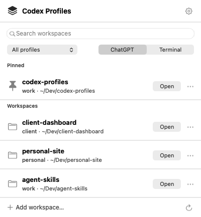
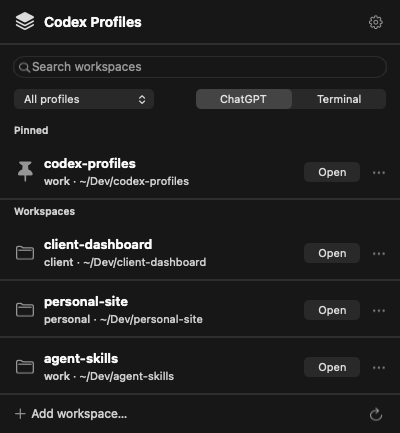

# Codex Profiles for macOS

The native menu-bar companion bundles the existing `codex-profile` engine.
It runs on macOS 13 or newer, on Apple silicon and Intel. It requires neither
Swift nor a separate `codex-profile` installation on the user's Mac.

Drag **Codex Profiles.app** to **Applications**, open it, and choose
**Add Workspace…**. Select an existing profile or create one, then choose a
project folder. The app opens its menu on first launch. **New Profile…** is
also available in its settings menu.

Open a workspace in **ChatGPT** to use the original installed ChatGPT app.
A named profile opens a window with separate local Desktop state and may
require sign-in inside that window. `default` uses the stock Desktop session.
**Sign In to Codex CLI** in the settings menu starts the official CLI login in
Terminal; it applies only to Codex. The app never reads tokens or cookies and
does not verify that Desktop and CLI use the same account.

ChatGPT launching requires the official desktop app. Terminal launching and
CLI login require the official Codex CLI, either installed separately or
available from the desktop app. Terminal actions may ask for macOS Automation
permission. Local-state separation does not isolate OS credentials or create
a server-side account boundary.

## Menu and keyboard

The menu uses system search, a profile filter and a ChatGPT/Terminal
destination control. Pinned projects appear first; other projects follow
their last successful launch. Rows show the project name, profile and folder,
with an explicit **Open** button and an actions menu. Missing folders and
profiles show the reason and retain actions for repair or removal.

Search receives focus when the menu opens. ↑/↓ selects available projects;
Return opens the selected project, or the first available search result.
⌘1–9 opens the corresponding visible row, ⌘K focuses search, and ⌘R refreshes.
Escape clears search before closing. Successful launches close the popover.

These are renders of the actual AppKit view in light and dark appearance.
They use an opaque system backdrop for layout review; live translucency is
provided by NSPopover and depends on macOS appearance and accessibility settings.




See the [design notes](CodexProfilesMenu/DESIGN.md) for Apple guidance and
interaction behaviour. Re-render the previews after changing the view:

```sh
scripts/macos/render-menu-preview.sh macos/CodexProfilesMenu/Previews/menu-light.png
scripts/macos/render-menu-preview.sh macos/CodexProfilesMenu/Previews/menu-dark.png --dark
```

## Build locally

Use a macOS source checkout with the Swift compiler and command-line tools:

```sh
make check
make menu-dmg
```

The builder compiles both architectures, bundles the CLI, license and icon,
and creates a compressed, read-only DMG with an Applications shortcut:

```text
build/macos/Codex Profiles.app
build/macos/Codex-Profiles-1.2.0-universal.dmg
build/macos/Codex-Profiles-1.2.0-universal.dmg.sha256
```

`make menu-app` builds just the app. `MENU_APP_BUILD_DIR` changes the output
directory. Bundle versions are taken from the bundled CLI. The canonical
`make check` discovers the native and DMG tests automatically; native builds
are skipped on hosts without macOS and Swift.

The default build is unsigned and intended for development. It is not a
public release and will not pass the normal Gatekeeper distribution checks.

## Sign and notarise a release

Install your **Developer ID Application** certificate and private key in
Keychain. List available identities with:

```sh
security find-identity -v -p codesigning
```

Store notarisation credentials interactively in Keychain, following
[Apple's notarisation workflow](https://developer.apple.com/documentation/security/customizing-the-notarization-workflow):

```sh
xcrun notarytool store-credentials codex-profiles
```

Then build the distributable with the exact certificate name:

```sh
MENU_APP_SIGNING_IDENTITY='Developer ID Application: Your Name (TEAMID)' \
MENU_APP_NOTARY_PROFILE=codex-profiles make menu-dmg
```

The script signs the companion with hardened runtime and the Apple Events
entitlement needed for Terminal, signs the DMG, submits it to Apple, requires
an **Accepted** result, staples and validates the ticket, and assesses the
DMG with Gatekeeper. It writes the final DMG and checksum only after those
checks pass. Notarisation results are retained beside the output for diagnosis.
No credentials are stored in the repository. The original ChatGPT app is
never modified or signed by this builder.

Follow [Apple's distribution testing guidance](https://developer.apple.com/documentation/xcode/packaging-mac-software-for-distribution)
to test a downloaded release on a fresh Mac, including opening from the image
and after moving to Applications. Publishing the resulting files is a separate
maintainer step; the build does not upload them to GitHub.
